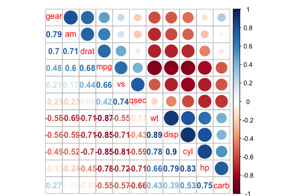
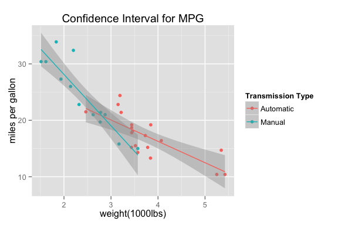

# Regression Model of Automatic and Manual Cars
## Executive Summary

- In this report we will use a dataset `mtcars` from the 1974 Motor Trend US magazine to explore if an automatic or manual transmission have different impact on miles per gallon (MPG), and How much is the difference.
- Using hypothesis testing and simple linear regression (regarding only transmission types), we found there is a signficant difference in MPG for automatic and manual cars, and manual cars has 7.245 more MPGs on average. However, this is a biased coefficient since we have other variables that are highly related to `mpg`. 
- To build a multivariate linear regression model, we used both correlation and nested likelihood ratio test to adjust the model for other confounding variables, such as the weight and horsepower of the car. 
- Runing a multivariate regression to get a better estimate of the difference, and validating by diagnostics plots.
- Multivariate linear model shows that with 85.87% confidence interval, manual cars has 2.084 more miles per gallon than automatic transmission cars, therefore, with 0.05 significance level, we concluded that there is no significantdifference between automatic and manual cars in MPG.

## Dataset - Motor Trend Car Road Tests
The data was extracted from the 1974 Motor Trend US magazine, and comprises fuel consumption and 10 aspects of automobile design and performance for 32 automobiles (1973–74 models).

- `mpg`         Miles/(US) gallon `cyl` Number of cylinders `disp` Displacement (cu.in.) 
- `hp` Gross horsepower `drat` Rear axle ratio `wt` Weight (lb/1000)
- `qsec` 1/4 mile time `vs` V/S `am` Transmission (0 = automatic, 1 = manual)
- `gear` Number of forward gears `carb`	 Number of carburetors


```r
data(mtcars)
```
encoded the following variables factor variables: am, vs

```r
mtcars1 <- transform(mtcars, am = as.factor(am), vs = as.factor(vs))
levels(mtcars1$am) <- c("Automatic", "Manual")
```
## Exploratoty Data Analysis

```r
library(ggplot2)
p <- ggplot(mtcars1, aes(factor(am), mpg))
p <- p + geom_boxplot(aes(fill = factor(am), alpha = 1/2)) 
p <- p + labs(title = "figure1:MPG by Transmission Type") 
p + labs(x = "Transmission Type", y = "Miles per Gallon")
```

 
Here, We considered only one variable `am` to explore `mpg`
The boxplot shows that there is a difference in the MPG by transmission type. Manual transmission seems to have more miles per gallon than automatic transmission. Let's do a simple Liner Regression model here.

## Simple Linear Regression
To begin our model testing, we fit a simple linear regression for `mpg` with only one regressor `am`.

*Null hypothesis: There is no difference in the mean MPG for automatic and manual transmission*

```r
fit <- lm(mpg~am, data = mtcars1)
sm <- summary(fit)
intercept <- sm$coef[1]
slope <- sm$coef[2]
sigma <- sm$sigma
rsquared <- sm$r.squared
p_value <- sm$coef[2,4]
sm$coef
```

```
##             Estimate Std. Error t value  Pr(>|t|)
## (Intercept)   17.147      1.125  15.247 1.134e-15
## amManual       7.245      1.764   4.106 2.850e-04
```
**Interpretting Coefficient**

- The Intercept 17.1474 is the average miles per gallon for automatic transmission, the Slope 7.2449 is the increased miles per gallon for manual transmision. 
- r-squred value 0.3598 means our model only explains 0.3598% of the total variance.
- With a p-value of 2.8502 &times; 10<sup>-4</sup>, we reject the null hypothesis and claim that there is a signficiant difference in the mean MPG between manual transmission cars and automatic transmission cars. 

## Multivariate Linear Regression

### Correlation
To choose the appropriate covariates for the regression model, we did covariate adjustment and multiple models to prob the effects. Before that, let's look at the corrlation for `mpg` variable of our dataset `mtcars`

```r
library(corrplot)
M <- cor(mtcars)
corrplot.mixed(M, order = "AOE")
```

 

In addition to `am` (which must be included in our regression model to campare the two types of transmission ), we see that `wt`, `cyl`, `disp`, and `hp` are highly correlated with our dependent variable mpg. As such, they may be good candidates to include in our model. However, after we look at the correlation matrix, we see that `cyl` is highly correlated with `hp`. and `disp` is highly correlated with `wt`, and they are both corrlated with each other. Since predictors should not exhibit collinearity, we may should not have cyl and disp in in our model. Let's explore deeper!

### Nested likelihood ratio test
*Null Hyphothesis: all of the three linear regression models are the same.*

```r
fit1 <- lm(mpg ~ am , data = mtcars1)
fit3 <- update(fit1, mpg ~ am + wt + hp)
fit5 <- update(fit1, mpg ~ am + wt + hp + cyl + disp)
var_table <- anova(fit1, fit3, fit5)
var_table
```

```
## Analysis of Variance Table
## 
## Model 1: mpg ~ am
## Model 2: mpg ~ am + wt + hp
## Model 3: mpg ~ am + wt + hp + cyl + disp
##   Res.Df RSS Df Sum of Sq     F  Pr(>F)    
## 1     30 721                               
## 2     28 180  2       541 43.08 5.6e-09 ***
## 3     26 163  2        17  1.37    0.27    
## ---
## Signif. codes:  0 '***' 0.001 '**' 0.01 '*' 0.05 '.' 0.1 ' ' 1
```
With p-value 5.5763 &times; 10<sup>-9</sup>, we reject the null hypothesis and claim that our multivariate model is significantly different from our simple model. And with p-value 0.2722, we accept the null hypothesis that our `fit5` model is the same as the `fit4` model. Therefore, we will include `wt` and `hp` in our regression equation, which makes sense intuitively, since heavier cars and cars with horsepower should have lower MPGs.

Therefore, our multivariate model is model 2: **lm(mpg ~ am + wt + am*wt + hp, data = mtcars1)** which has three regressors `am`,`wd` and `hp` for `mpg`.

*Null hypothesis: There is no difference in the mean MPG for automatic and manual transmission*

### Residual Diagnostics & Summarize 

```r
fitbest <- lm(mpg ~ am + wt + hp, data = mtcars1)
par(mfrow = c(2,2), mar = c(3,1,2,2))
plot(fitbest)
```

 


Diagnostic plots show the residuals are normally distributed and homoskedastic. We can now summarize our model

```r
fitbest <- lm(mpg ~ am + wt + hp, data = mtcars1)
smbest <- summary(fitbest)
intercept1 <- smbest$coef[1]
slope1 <- smbest$coef[2]
sigma1 <- smbest$sigma
rsquared1 <- smbest$r.squared
p_value1 <- smbest$coef[2,4]
smbest$coef
```

```
##             Estimate Std. Error t value  Pr(>|t|)
## (Intercept) 34.00288   2.642659  12.867 2.824e-13
## amManual     2.08371   1.376420   1.514 1.413e-01
## wt          -2.87858   0.904971  -3.181 3.574e-03
## hp          -0.03748   0.009605  -3.902 5.464e-04
```

### Plot Prediction Value for MPG

```r
h <- ggplot(mtcars1, aes(wt, mpg, colour = factor(am)))
h + geom_point() + stat_smooth(method = lm)  + labs(x = "weight(1000lbs)", y = "miles per gallon", title = "Confidence Interval for MPG") + scale_colour_discrete(name = "Transmission Type")
```

 

**Interpretting Coefficient**

- The Intercept 34.0029 is the average miles per gallon for automatic transmission when `wt` and `mpg` equal to 0, and the Slope 2.0837 is the increased miles per gallon for manual transmision. 
- r-squred value 0.8399 shows that our model explains 0.8399% of the total variance. 
- With a p-value of 0.1413, we have only 0.8587% confidence interval to reject the null hypothesis, therefore, with the 0.05 significance level, we claim that **no signficiant difference for MPG exist in manual and automatic transmission cars*. The small p_value for wt and hp show that `wt` and `hp` did indeed confound the relationship between am and mpg

